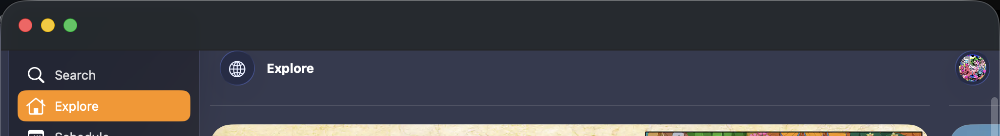
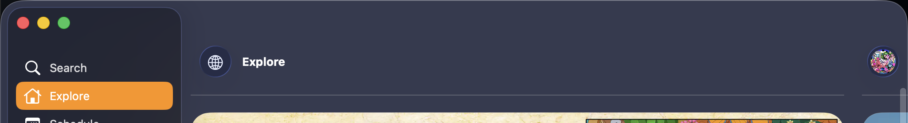
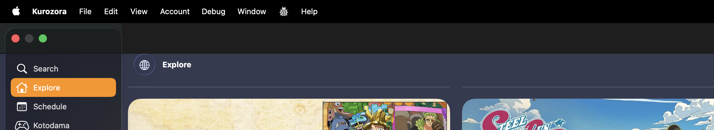
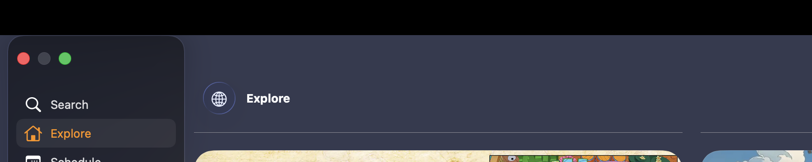

Kurozora runs its sidebar to the top of the window on Mac, with the window buttons over it. That takes an `NSToolbar` with no items: the toolbar is there to make the titlebar taller, and the taller titlebar is what gives the sidebar its full height.

Windowed, it works. It produces two separate defects around full screen.

Entering full screen paints a flat slab across the top of the content, and revealing the menu bar slides a rounded fragment of sidebar over the navigation bar. Separately, quitting from full screen and relaunching so macOS restores into full screen leaves a dark band across the titlebar after you return to a window.

Both fixes are small. The restored-window band needs the toolbar cleared and reassigned, and the full screen slab needs `alphaValue = 0` on two private background views, in both of the windows that can host the titlebar.

## Comparing a healthy window with a broken one



For the restored-window band, every property worth suspecting is identical between a normal launch and a restored one. Attaching lldb and reading them off the live window gives the same `styleMask` of `0x800F` with `fullSizeContentView` set, the same `titlebarAppearsTransparent = 0`, the same hidden `titleVisibility`, the same clear `backgroundColor`, the same `titlebarSeparatorStyle`. `UIWindow.safeAreaInsets` is `{52,0,0,0}` in both windowed and full screen, so there is no UIKit-visible signal to hook either.

The UIKit view tree matches as well. The only difference in it is the sampled `luma` of the top `ScrollEdgeEffectView`, which is the band being measured rather than the band's cause.

The difference is one layer into AppKit, and it is a single tell:

```
titlebarBackgroundView.layer.sublayers   // nil on a healthy launch
                                         // holds a layer named NSScrollPocket when broken
```

A window restored directly into full screen gets an `NSScrollPocket` installed into its `NSTitlebarBackgroundView`, stuck in the opaque `NSHardPocketView` variant, and it survives leaving full screen.

## Rebuilding the toolbar removes the pocket

Assigning a new `NSToolbar` over the existing one rebuilds the pocket along with it. Clearing first does not.

```swift
private func installTitlebarToolbar() {
    guard let titlebar = self.window?.windowScene?.titlebar else { return }

    let toolbar = NSToolbar()
    toolbar.displayMode = .iconOnly

    // Clearing first tears down the scroll pocket a full screen restore leaves behind.
    titlebar.toolbar = nil
    titlebar.toolbar = toolbar
}
```

Call it on `NSWindowDidExitFullScreenNotification`, observed by string since Catalyst does receive the AppKit name. Leaving the toolbar at `nil` also removes the pocket, but shrinks the titlebar from 52pt to 28pt and moves all the content up, which is the opposite of what the empty toolbar was for.



## Locating the titlebar in full screen



The full screen slab needs the view that paints it, and in full screen the titlebar is not where you left it. AppKit does not remove it: it relocates `NSTitlebarContainerView` into a separate `NSToolbarFullScreenWindow`, the same as it does for native apps.

Walking that window with KVC finds two `NSTitlebarBackgroundView`s under `NSTitlebarView`:

```
f=(1,0,2055,52)   full width, paints the flat slab over the content
f=(0,0,205,52)    sidebar width, holds another NSScrollPocket
```

The sidebar-width one is the rounded fragment that appears on menu bar reveal. Both paint only in full screen, because an item-less toolbar leaves them nothing to draw over.

Two findings came out of instrumenting the fix rather than reading the code, and both changed the implementation.

Setting `hidden = YES` on the two views does nothing. Since `print()` does not reach stdout when the app is launched with `open`, and neither `print()` nor `NSLog()` showed up under `log show`, the way to confirm the code ran at all was writing counters into `UserDefaults` and reading them back with `defaults read`. The counters proved both views were found and hidden on every full screen entry while the slab still rendered. AppKit drives `hidden` itself for the titlebar slide and puts it straight back. `alphaValue` is not managed, and it sticks.

Fixing only the toolbar window then left the slab in place over the content column while correcting the sidebar column. Sampling pixel colors across the window showed the theme color at x=100 and `rgb(36,40,42)` at x=400 and x=1500. In the steady state, with the titlebar hidden, AppKit takes it back into the main window through `_reacquireToolbarFullScreenAuxiliaryView:` and `NSToolbarFullScreenWindow` leaves `NSApp.windows` entirely. There are two possible hosts and both need covering.

## Fading both hosts

```swift
for window in windows {
    let styleMask = window.value(forKey: "styleMask") as? UInt ?? 0
    let hostsTitlebar = window.isKind(of: toolbarWindowClass) || (styleMask & fullScreenMask) != 0

    guard
        hostsTitlebar,
        let contentView = window.value(forKey: "contentView") as? NSObject,
        let frameView = contentView.value(forKey: "superview") as? NSObject,
        let container = descendant(of: frameView, ofClass: containerClass, depth: 0),
        let titlebarView = (container.value(forKey: "subviews") as? [NSObject])?.first,
        let titlebarSubviews = titlebarView.value(forKey: "subviews") as? [NSObject]
    else { continue }

    for background in titlebarSubviews where background.isKind(of: backgroundClass) {
        background.setValue(alpha, forKey: "alphaValue")
    }
}
```

`fullScreenMask` is `1 << 14`. The search for the container is depth-limited rather than fixed, because it sits one level deeper in the toolbar window than in the main window. Zero on entering full screen, one on leaving, so the windowed titlebar is untouched.

Fading is also better than painting the slab in the theme color. The content is already laid out underneath, with the navigation bar at its usual 52pt inset, so removing the paint reveals the real thing, including the sidebar's own material in the sidebar column. A flat fill would get that column wrong.



## Approaches that do not work

For the restored-window band, `titlebar.separatorStyle = .none` has no effect, and assigning a fresh toolbar without clearing first rebuilds the pocket.

For the full screen slab, `titlebar.toolbarStyle = .unified` has no effect. Neither does hiding the two `NSVisualEffectView` siblings of the titlebar container, nor setting the toolbar window's `backgroundColor` to clear with `opaque = NO`. `titlebarAppearsTransparent = YES` on the main window only shifts the slab from `rgb(30,30,30)` to `rgb(36,40,42)`. `alphaValue = 0` on the whole toolbar window does clear it, and takes the window buttons with it.

Dropping the toolbar entirely on `NSWindowWillEnterFullScreenNotification` looks like the clean answer and regresses the thing the toolbar exists for. Measured across that change, the navigation bar moves from y=52 to y=10 and the sidebar from y=8 to y=32. Keep the toolbar and fix the paint.

One debugging note worth carrying: poking the live window's `backgroundColor`, `opaque` or titlebar alpha from lldb destabilises compositing and switches Spaces, after which screenshots capture the wrong Space and read as results. Relaunch clean between experiments.
