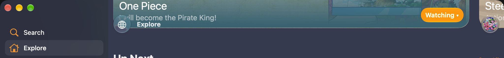
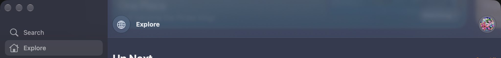
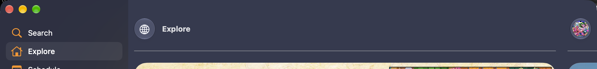
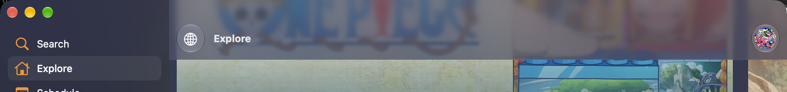

The scroll edge effect style lives on the scroll view, as `UIScrollView.topEdgeEffect.style`, and takes `.soft`, `.automatic` or `.hard`. Kurozora applies one across the app through a `layoutSubviews` swizzle.

On iPhone and iPad that works. On macOS 27, the navigation bar draws nothing while content runs under it.



Move the pointer onto the bar and a backdrop appears. It is a hard cutoff, not the graduated blur of the `.soft` style the scroll view is carrying.

macOS 26 did neither of those things.

## The sidebar is the counter-example

The sidebar's own effect works on the same OS, in the same process, on the same class. It engages on its own and it renders whichever style is set, `.soft` and `.hard` both reaching it correctly.

That rules out anything global. The style plumbing is fine and the renderer is fine. The read that fits both surfaces is that the failure is confined to scroll views with a bar registered over them, which is the difference between the two. It rests on those two data points and was not swept across the rest of the app.

## No public API reaches it

AppKit gained `NSScrollEdgeEffectStyle` in macOS 26.1, with `preferredScrollEdgeEffectStyle` on `NSTitlebarAccessoryViewController` and `NSSplitViewItemAccessoryViewController`. Both are `API_UNAVAILABLE(macCatalyst)`.

The UIKit 27.2 headers expose `UIScrollEdgeEffect.style` and `isHidden`, and nothing else. The style is already the selected value and `isHidden` is already `false` on both the working and the broken path, so neither is the lever. There is no bar level hook: `UIScrollEdgeEffect` and `UIScrollEdgeEffectStyle` are not `UIAppearance` participants, and setting a transparent `UINavigationBarAppearance` changes nothing.

Nothing is coming from the AppKit side either. No `NSScrollPocket` is built for a `.pad` behavioral style bar, and both `NSTitlebarBackgroundView`s are hidden.

## Pocket is UIKit's name for the scroll edge effect view

`_UIScrollEdgeEffectViewInteraction` owns `topPocket`, `bottomPocket`, `leftPocket` and `rightPocket` ivars. Each one is a `UIKit.ScrollEdgeEffectView`, the same class backing the sidebar's working effect. Pocket is an internal name for the same view, not a separate Mac construct, so anything that drives a pocket drives the real scroll edge effect.

Two private classes are involved and they are easy to confuse:

- `_UIScrollPocketBarInteraction` sits on the navigation bar and registers the bar's rect.
- `_UIScrollEdgeEffectViewInteraction` sits on the scroll view and owns the views that draw.

The second one carries the lever. Both print their own state:

```
-[_UIScrollPocketBarInteraction dumpBarConfigs]
-[_UIScrollPocketBarInteraction dumpResolvedBarConfigs]
-[_UIScrollPocketBarInteraction dumpReceivers]
-[_UIScrollEdgeEffectViewInteraction debugInfoVerbose:]
```

`debugInfoVerbose:` prints a line per edge, `topEdge=<style=soft backgroundCapture=…>`, which settles the style question on the spot: the value arrives correctly and is not the cause.

One reading trap lives in `dumpResolvedBarConfigs`. Resolved rects are in content coordinates, so their `y` carries the content offset. A navigation bar resolving to `y = 339.5` inside a scrolled collection view is correct.

Both dumps came from `+[NSObject _shortMethodDescription]` on the class object, which is the fastest route to a lever on any private UIKit object. `-[NSObject _ivarDescription]` covers the instance side.

## The scroll input is dead, the hover input is not

The interaction wants to draw. `needsPockets` returns `YES` while the pocket layer sits at opacity `0`, so the decision to stay hidden is being made, not skipped.

Feeding it a content rect covering the entire scroll view does not change that, and neither does calling `update` directly.

```objc
[interaction updateWithContentRect:CGRectMake(0, 0, 1024, 5000) shouldAnimateVisibility:NO];
// pocket layer opacity: 0

[interaction update];
// pocket layer opacity: 0
```

One flag does.

```objc
[interaction setIsMouseHovering:YES];
// pocket layer opacity: 1
```

That is the bug. The interaction computes pocket visibility from scroll position and from hover. On macCatalyst 27 the scroll side is dead for scroll views with a bar over them, and hover is the only live input left, which is exactly the reported symptom.

## Still open: the band on an inactive window

Clicking another window also puts a band across the bar, and that one is not explained by any of this.



With the window inactive and content behind the bar, the band is on screen while the pocket's root layer reads `opacity = 0`, the identical reading taken from the focused state where no band is drawn. Whatever paints it, it is not the pocket, and no `NSScrollPocket` exists on the AppKit side to account for it either. It was never identified.

Treat the hover reveal and the inactive band as two separate behaviors. Only the first one is the pocket, and only the first one is what the fix below addresses.

## Driving the flag from the content offset

The app already swizzles `layoutSubviews` to apply the style, so the flag can be driven from the same pass.

```swift
#if targetEnvironment(macCatalyst)
/// Shows the scroll edge effect while content sits behind the bars.
private func syncScrollEdgeEffectVisibility() {
    guard
        let interactionClass = NSClassFromString("_UIScrollEdgeEffectViewInteraction"),
        let interaction = self.interactions.lazy.compactMap({ $0 as? NSObject }).first(where: { $0.isKind(of: interactionClass) })
    else { return }

    let hoverKey = "isMouseHovering"
    let isContentBehindBars = self.contentOffset.y > -self.adjustedContentInset.top

    guard interaction.value(forKey: hoverKey) as? Bool != isContentBehindBars else { return }

    interaction.setValue(isContentBehindBars, forKey: hoverKey)
}
#endif
```

Two things in there matter.

`adjustedContentInset` rather than `contentInset`, because the bar's height arrives as an adjustment rather than as the app's own inset. `contentOffset.y > -adjustedContentInset.top` is then true exactly while something is behind the bar.

The compare before write, because this runs on every layout pass and writing an unchanged value invites another one.

The trade is worth naming: hover to reveal becomes scroll to reveal, which is the iOS behavior and the reason for the fix.

## The style cannot ride along

Driving that flag restores visibility and nothing else. The interaction reports `style=soft`, `topEdgeEffect.style` is set correctly, and the main content still renders the solid backdrop every time, the same appearance hover always produced. The sidebar is untouched by this and keeps honoring the style, because UIKit's own logic still drives it there.

`ScrollEdgeEffectView` exposes `_debugElection` and `_debugBallot`, UIKit's own record of how it elects an appearance, but both return `nil` unless the pocket debug instrumentation is switched on, so they cannot confirm it either.

So on Catalyst the navigation bar's style is not yours to choose. Whatever you set, you get the solid backdrop. That is also what Finder and Mail do, soft in the sidebar and hard in the content, so the result is right for the platform even though it is not selectable. Worth pinning `.automatic` there rather than leaving code that reads as if the value still applies. iOS is unaffected and honors all three.

## What it looks like now

At the top of a list the bar is clean.



With content behind it the backdrop is there and the title is legible.



## Levers that do not work

Each of these was tested on the live process and none of them restores engagement:

- Removing `_UIScrollPocketBarInteraction` from the navigation bar. Post hoc removal does not re-evaluate anything.
- Hiding the navigation bar entirely.
- Swizzling `+[_UIScrollPocketBarInteraction isEnabled]` to `NO`, then navigating to a screen built afterwards. It is a cached global switch for the whole pocket mechanism, and a screen built with it off still does not engage. It was never off from launch, so that case is untested.
- `topEdgeEffect.isHidden`, already `false` on both paths.
- Re-installing an `NSToolbar` on the live window's titlebar.
- `[interaction update]` and `updateWithContentRect:shouldAnimateVisibility:` with a rect covering the whole scroll view.
- Style thrash from the swizzle. `softStyle` and `hardStyle` are stable singletons, so the `!==` guard holds and the value is not being rewritten every pass.

This is a workaround for an OS regression. If a 27.x update restores the scroll driven input, the styled rendering should return on its own, at which point the flag no longer needs driving.
