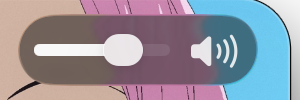

Kurozora's music player fills its volume slider track in white rather than the system accent. On iOS that is one property. In the Catalyst Mac idiom `minimumTrackTintColor`, `maximumTrackTintColor`, `thumbTintColor` and the track and thumb image setters all raise an exception mentioning `UIBehavioralStyle`. The control is not ignoring the value, it refuses the call.

The fix is to reach the AppKit control the slider hosts and set its public `trackFillColor`.

## The documented alternative changes the control

`preferredBehavioralStyle = .pad` makes the slider behave like the iOS one and restores every tint property. It also replaces the Mac's oval knob with the iOS circle and drops the press morph.

For a control whose whole purpose was to look native on macOS that is the wrong trade. There is no third public option, so the question becomes what the Mac idiom slider actually is.

## Finding the hosted control

Dumping the view hierarchy under a `UISlider` in the Mac idiom shows it is not drawing anything itself. It hosts a real AppKit `NSSlider` inside a private `_UINSView`, and that view exposes the AppKit object through a `contentNSView` property.

That reframes the problem. `NSSlider` has had a public `trackFillColor` since macOS 10.12, so the color that UIKit refuses is available one level down, through an API that is documented and stable. Only the route to the object is private.

```swift
private func hostedAppKitSlider() -> NSObject? {
    let contentKey = "contentNSView"
    var candidates: [UIView] = [self.systemSlider]

    while let view = candidates.popLast() {
        if view.responds(to: NSSelectorFromString(contentKey)), let hosted = view.value(forKey: contentKey) as? NSObject {
            return hosted
        }
        candidates.append(contentsOf: view.subviews)
    }

    return nil
}
```

The walk searches for the first view that responds to the key rather than assuming a fixed depth, since the number of intermediate views is not contractual.

## Applying the color

```swift
private func applyTrackFill() {
    guard !self.didApplyTrackFill, let appKitSlider = self.hostedAppKitSlider() else { return }

    let selector = NSSelectorFromString("setTrackFillColor:")
    guard
        appKitSlider.responds(to: selector),
        let colorClass = NSClassFromString("NSColor") as? NSObject.Type,
        let labelColor = colorClass.perform(NSSelectorFromString("labelColor"))?.takeUnretainedValue()
    else { return }

    appKitSlider.perform(selector, with: labelColor)
    self.didApplyTrackFill = true
}
```



The knob and the press morph are unaffected, because the control is still the system one.

Three details decide whether this holds up.

The color is `NSColor.labelColor`, a semantic AppKit color, so it resolves against the window's appearance. Light and dark both come out correct from a single application. A resolved `UIColor` converted across would need reapplying on every appearance change.

The call belongs in `layoutSubviews`, retried until it succeeds and then latched. The hosted view does not exist until the slider has been laid out at least once, so applying it during initialization finds nothing.

Every step is guarded. `responds(to:)` on the selector, an optional cast on the class lookup, and a `nil` return from the walk mean a future OS that reorganizes this hierarchy produces a default slider rather than a crash.

## Why not draw the thumb instead

The version this replaced was a custom thumb: a white tinted `UIGlassEffect` view, matched against a reference screenshot until the crops lined up.

It was wrong for a reason no amount of matching fixes. An oval knob that morphs under press is `UISlider` behavior in the Mac idiom, so a hand built thumb has to reimplement the morph, the press states, the appearance switching and whatever changes next release. Matching a static screenshot cannot capture behavior, and behavior is what identifies the control as native.

Where a control's behavior is the thing you want, keep the control and change the one property you need.
