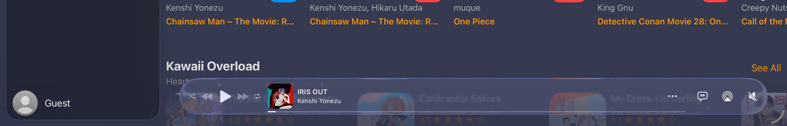

Kurozora puts its now playing bar in the iOS 26 tab bar accessory, through `UITabBarController.bottomAccessory`. On iPad the bar has to keep a fixed height and stay within the readable content width, so it lines up with the content beside the sidebar instead of stretching the full window.

Cross an iPad window between the regular layout with a sidebar and the compact layout with a bottom tab bar, then cross back, and the accessory keeps the compact size: height around 48 instead of 64, width whatever the compact layout last used.


The fix is to set the frame of the accessory's private container view from the tab bar controller's `viewDidLayoutSubviews`, keeping the horizontal center the system chose.

## Neither constraints nor intrinsic size apply

`UITabAccessory` exposes `contentView` and `init(contentView:)`, and nothing else. There is no placement or sizing property. `automaticallyPlacesContentView` belongs to `UIBackgroundExtensionView` and is not related.

Auto Layout constraints on the content view are ignored, and so is `intrinsicContentSize`. The system positions and sizes that view through autoresizing without consulting either, which is workable for as long as it keeps sizing the view correctly. That is what stops after the resize.

## Identifying what stalls

Logging the accessory's `bounds`, the controller's `horizontalSizeClass` and `tabAccessoryEnvironment` on every layout pass, together with a dump of the view chain above the content view, separates the possibilities.

The environment is correct. `tabAccessoryEnvironment` reports `regular` again after the round trip, so the system has not misclassified the layout. The container's position is also correct, and updated continuously: the system re-centers it on every pass. Only the size is stale, and it is the size the compact layout left behind.

That rules out a state problem and makes it a layout problem confined to the accessory. The view chain dump supplies the target: the content view's superview is `_UITabAccessoryContainer`, and that is the view holding the frame.

Three resets were tried against that and none works. Re-seating `setBottomAccessory` with the same content view changes nothing. Re-seating it with a freshly built accessory changes nothing either, because the size class transition fires at the layout boundary where a fresh accessory is also created small. Toggling `tabBarMinimizeBehavior` has no effect. The `tabs` reassignment that happens on a size class change is not the cause.

## Setting the container frame from the controller

The accessory's own layout has stalled, but the tab bar controller's has not, so the frame can be driven from there.

```swift
private func updateMusicAccessorySize() {
    guard #available(iOS 26.0, *), self.traitCollection.horizontalSizeClass == .regular else { return }
    guard let container = self.musicAccessoryContentView?.superview, let containerParent = container.superview else { return }

    let horizontalInset: CGFloat = 16
    let center = container.frame.midX
    let widthFittingContentArea = max(0, 2 * (containerParent.bounds.width - horizontalInset - center))

    let readableWidth = self.view.readableContentGuide.layoutFrame.width
    let targetWidth = min(readableWidth > 0 ? readableWidth : widthFittingContentArea, widthFittingContentArea)
    let targetHeight: CGFloat = 64
    guard targetWidth > 0 else { return }

    let targetFrame = CGRect(
        x: (center - targetWidth / 2).rounded(),
        y: (container.frame.maxY - targetHeight).rounded(),
        width: targetWidth.rounded(),
        height: targetHeight
    )

    if container.frame != targetFrame {
        container.frame = targetFrame
    }
}
```

Three decisions in there are worth spelling out.

The existing center is read rather than computed. The system centers the container on the content area, to the right of the sidebar, and that value is correct even when the size is not. Capping the width symmetrically around it means the bar can never cross into the sidebar, without needing a sidebar width to read, which is not exposed.

The vertical position comes from `maxY` rather than an origin, so the bar grows upward from its bottom edge instead of drifting down into the tab bar.

The equality check matters because this runs from `viewDidLayoutSubviews`. Assigning an identical frame triggers another layout pass and the method feeds itself.



## The same problem on Mac Catalyst

Catalyst does not freeze, but it does not honor the height either. The same approach works from the other end of the hierarchy: the content view adjusts its own superview during `layoutSubviews`, compensating the origin so the height change grows the bar upward.

```swift
private func enforceAccessoryHeight() {
    #if targetEnvironment(macCatalyst)
    guard let accessoryView = self.superview else { return }

    let delta = accessoryView.bounds.height - self.accessoryHeight
    guard abs(delta) > 0.5 else { return }

    var frame = accessoryView.frame
    frame.origin.y += delta
    frame.size.height = self.accessoryHeight
    accessoryView.frame = frame
    #endif
}
```

The tolerance check plays the same role as the equality check on iOS, and for the same reason.

Both versions reach into a view the framework owns, which is worth avoiding where an API exists. For this accessory none does: constraints and `intrinsicContentSize` are both ignored by design, and the size class round trip leaves no supported way to ask for a resize.
